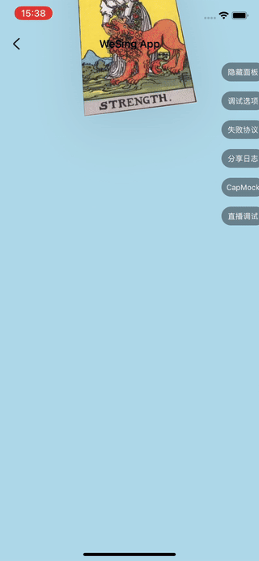

# react-spring-hippy
[react-spring](https://www.react-spring.dev/) target for Tencent/Hippy

Modified from react spring offical demo with some necessary modification to make it works in hippy:

> origin demo(web): https://codesandbox.io/p/sandbox/cards-stack-to6uf?file=%2Fsrc%2FApp.tsx



## 快速开始

1. 安装

```bash
npm install react-spring-hippy -D
```

2. 参考 [react-spring 文档](https://www.react-spring.dev/docs/getting-started)了解使用方式。

## 前面 gif 的 demo 代码:

```typescript
import { TouchableEvent, View } from '@hippy/react'
import React, { useMemo, useRef } from 'react'
import { animated, useSprings } from 'react-spring-hippy'

// 卡片封面
const cards = [
  'https://upload.wikimedia.org/wikipedia/commons/f/f5/RWS_Tarot_08_Strength.jpg',
  'https://upload.wikimedia.org/wikipedia/commons/5/53/RWS_Tarot_16_Tower.jpg',
  'https://upload.wikimedia.org/wikipedia/commons/9/9b/RWS_Tarot_07_Chariot.jpg',
  'https://upload.wikimedia.org/wikipedia/commons/thumb/8/88/RWS_Tarot_02_High_Priestess.jpg/690px-RWS_Tarot_02_High_Priestess.jpg',
  'https://upload.wikimedia.org/wikipedia/commons/d/de/RWS_Tarot_01_Magician.jpg',
]

// 用于生成每张卡片，初始飞入动画的终点
const to = (i: number) => ({
  x: (750 - 250) / 2,
  y: i * -4 + 600,
  scale: 1,
  rotX: `25deg`,
  rotZ: `${-10 + Math.random() * 20}deg`,
  delay: i * 100,
  shadow: 0.1,
})

function Deck() {
  const [props, api] = useSprings(cards.length, (i) => ({
    ...to(i),
    // 初始飞入动画的起点
    from: {
      x: (750 - 250) / 2,
      rotX: `25deg`,
      rotZ: '0deg',
      scale: 1.5,
      y: -1000,
      shadow: 0.1,
    },
  }))

  // 用于记录 TouchDown 时的坐标，辅助实现左右滑动卡片
  const xRef = useRef(0)
  // 当前是否正在触摸中
  const downRef = useRef(false)
  // 记录划走了几张卡片
  const gone = useMemo(() => new Set(), [])

  // 触摸事件中更新动画的逻辑
  const update = (index, mx, down) => {
    api.start((i) => {
      if (index !== i) return
      const x = (750 - 250) / 2 + mx
      const rotZ = `${(x - (750 - 250) / 2) / 70}deg`
      return {
        x,
        // react-spring 可以插值字符串
        rotX: down ? '0deg' : '25deg',
        rotZ,
        scale: down ? 1.1 : 1,
        delay: undefined,
        config: { friction: 50, tension: down ? 800 : 500 },
        shadow: down ? 0.4 : 0.1,
      }
    })
  }

  const handleTouchDown = (index: number, e: TouchableEvent<'onTouchDown'>) => {
    xRef.current = e.page_x
    downRef.current = true
    update(index, 0, true)
    return false
  }

  // 飞走的逻辑
  const flyout = (index, dir) => {
    api.start((i) => {
      if (index !== i) return

      return {
        x: (750 + 100) * dir,
        rotZ: `${dir * 45}deg`,
        scale: 0.7,
        shadow: 0.1,
      }
    })
    gone.add(index)
    if (gone.size === cards.length)
      setTimeout(() => {
        gone.clear()
        api.start((i) => to(i))
      }, 300)
  }

  const handleTouchMove = (index: number, e: TouchableEvent<'onTouchMove'>) => {
    const mx = e.page_x - xRef.current
    const down = downRef.current
    // 触摸移动中不断更新动画
    update(index, mx, down)

    return false
  }

  const handleTouchEnd = (index: number, e: TouchableEvent<'onTouchEnd'>) => {
    const mx = e.page_x - xRef.current
    xRef.current = 0
    downRef.current = false
    if (Math.abs(mx) > 160) {
      flyout(index, mx > 0 ? 1 : -1)
    } else {
      update(index, 0, false)
    }
    return false
  }

  return (
    <>
      {props.map(({ x, y, rotX, rotZ, scale, shadow }, i) => (
        <animated.View
          key={i}
          style={
            {
              position: 'absolute',
              width: 250,
              height: 440,
              alignItems: 'center',
              justifyContent: 'center',
              flex: 1,
              top: y,
              left: x,
            } as any
          }
        >
          <animated.View
            onTouchDown={(e) => handleTouchDown(i, e)}
            onTouchMove={(e) => handleTouchMove(i, e)}
            onTouchEnd={(e) => handleTouchEnd(i, e)}
            style={
              {
                backgroundColor: 'white',
                width: 250,
                height: 440,
                transform: [{ rotateX: rotX, rotateZ: rotZ }, { scale }],
                boxShadowOpacity: shadow,
                boxShadowRadius: 32,
                boxShadowOffsetY: 10,
                boxShadowColor: '#000000',
              } as any // 刚刚跑通还有不少地方可以完善
            }
          >
            <animated.Image
              source={{ uri: cards[i]! }}
              style={{
                width: 250,
                height: 440,
              }}
            />
          </animated.View>
        </animated.View>
      ))}
    </>
  )
}

export default function App() {
  return (
    <View
      style={{
        flex: 1,
        alignItems: 'center',
        justifyContent: 'center',
        backgroundColor: 'lightblue',
      }}
    >
      <Deck />
    </View>
  )
}
```

## 同步到工蜂

上架内部 hippy 组件市场需要提供工蜂仓库，一个简单的同步方案：

```bash
# 1. 在 clone github 仓库后，应该有一个 origin remote
git remote
# origin

# 2. 给 origin remote 配置多个 push urls
git remote set-url --push --add origin https://zcfan@github.com/zcfan/react-spring-hippy.git
git remote set-url --push --add origin <对应的工蜂仓库 git repo 地址>

# 3. 检查配置是否正确
git remote show origin
# * remote origin
#   Fetch URL: https://zcfan@github.com/zcfan/react-spring-hippy.git
#   Push  URL: <对应的工蜂仓库 git repo 地址>
#   Push  URL: https://zcfan@github.com/zcfan/react-spring-hippy.git

# 4. 修改后正常 push 即可
```